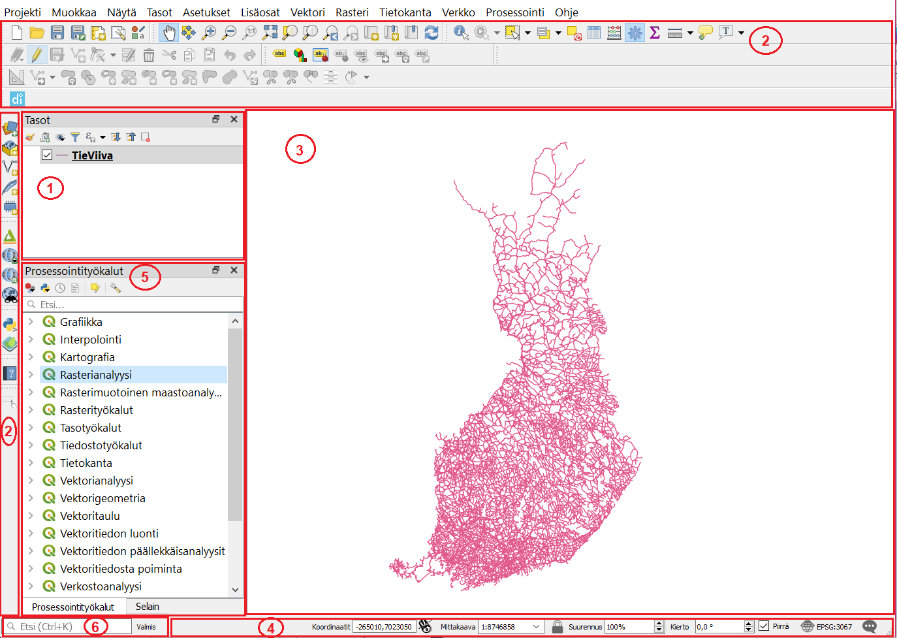

# Harjoitus 1: QGISin käyttöliittymä

#### Harjoituksen sisältö
Harjoituksessa tutustutaan QGIS–ohjelmiston käyttöliittymään ja sen perustoimintoihin.
#### Harjoituksen tavoite
Koulutettava oppii käyttämään QGISin käyttöliittymää.

### Valmistautuminen
Avaa web-selain ja mene QGISin suomenkielisille web-sivuille. 
> http://www.qgis.org/fi/site/

Löydät etusivulta linkin, jonka avulla pääset lataamaan QGIS-työpöytäohjelmiston. Lataa sivustolta **QGISin pitkäaikaisversio (long term release)**. Pitkäaikaisversio on stabiilein QGIS-versio, mutta siitä voi puuttua uudempien versioiden uusia ominaisuuksia.
QGISin voi asentaa Windows-, Linux- tai Mac-käyttöjärjestelmään. Eri järjestelmien QGIS-versioiden välillä huomattavimmat erot ovat väriskeemoissa ja tiedostopoluissa – muuten erot ovat hyvin pieniä.

### Kurssimateriaalien lataus
Kouluttaja ohjeistaa sinua lataamaan kurssimateriaalit joko muistitikulta, Google Drivestä tai AWS-palvelimelta. Kopioi kurssimateriaalit koulutuskoneelle haluamaasi kansioon niin, että löydät ne helposti jatkossa. Voit kirjoittaa muistiinpanoja harjoitusten viimeiselle sivulle.
Kun kurssimateriaalissa viitataan **.../kurssihakemisto/**, tarkoitetaan itse määrittelemääsi kurssihakemiston polkua.

### QGISin käyttöliittymä
Käynnistä QGIS. QGISin käyttöliittymä saattaa aueta englanninkielisenä ensimmäisellä käyttökerralla. Voit vaihtaa kielen suomeksi asetuksista **Settings → Options → General → User** 

**Interface Translation → suomi**. Paina lopuksi OK. Huomaa, että kielen vaihtamisen aktivoimiseksi sinun tulee käynnistää QGIS uudelleen.
Lisää ensimmäinen vektorimuotoinen paikkatietoaineisto napsauttamalla **Avaa tietolähteiden hallinta –pikakuvakenäppäintä**: 
Löydät saman toiminnon myös Tasot-valikosta **Lisää taso → Lisää vektoritaso…** (Ctrl+Shift+V).
Valitse avautuvasta ikkunasta vasemmalta puolelta **Vektori-välilehti**. Lisää aineisto kurssin materiaaleista (**.../kurssihakemisto/MML/YK_1M/**). Valitse nyt Maanmittauslaitoksen 1:1M-aineistosta **TieViiva.shp-tiedosto**. Paina lopuksi **Lisää** ja sulje ikkuna.

Aineiston pitäisi näkyä seuraavan sivun esimerkin mukaisesti (huom! viivan väri saattaa olla eri).

### QGIS-käyttöliittymän osat

#### 1. Tasoluettelo
Tähän osioon tulevat näkyviin paikkatietoaineistot, jotka näkyvät karttaikkunassa. Voit hallita tasojen järjestystä ja näkyvyyttä.

#### 2. Työkalupalkit
Työkalupalkit sisältävät erilaisia työkaluja. Omassa tietokoneessasi voi olla näkyvissä enemmän tai vähemmän työkalupalkkeja. Napauttamalla hiiren oikea näppäintä työkalupalkkien päällä, voit piilottaa tai ottaa esiin työkalupalkkeja. Voit myös raahata työkalupalkkeja eri kohtiin.

#### 3. Karttaikkuna
Karttaikkunaan piirtyvät ne paikkatietoaineistot, jotka ovat tasoluettelossa aktivoituna näkyväksi. Voit lähentää ja loitontaa karttaa sekä paneroida siinä hiiren avulla (koita myös hiiren scrollia). 

#### 4. Tilapalkki
Tilapalkista näet hiiren kursorin koordinaatit, minkä lisäksi voit muuttaa mittakaavaa ja koordinaattijärjestelmää.

#### 5. Prosessointi- ja selain-paneeli
Aikaisemmassa harjoituksessa tutustuttiinkin jo hieman QGISin uuteen Selain-paneeliin, joka aikaisemmissa versioissa on ollut erillisenä ohjelmana. Myös Prosessointityökalut saa kätevästi esille paneeliksi, jolloin ne ovat aina helposti löydettävissä. Prosessointyökaluista löydät esim. vektori- ja rasterianalyysityökalut.

#### 6. Hakutoiminto
Joskus on vaikea muistaa, mistä mikäkin työkalu ja toiminto valikosta löytyy. Hakutoiminnolla voit helposti etsiä näitä näppäilemällä CTRL+K ja kirjoittamalla etsimäsi toiminnon hakukenttään.

### Kokeile itse
Kokeile erilaisia työkaluja ja tarkastele ainakin seuraavien työkalujen toimintaa.
Työkalupalkin toiminnot (käyttöliittymän yläosassa):

Paikanna edellä näkyneestä työkalurivistä seuraavat työkalut ja tunnista niiden tarkoitukset:
Zoomaa täydeksi

Zoomaa tasoon

Näytä kohteen tiedot

Avaa attribuuttitaulu

Mittaa viivan pituus 

Kokeile myös seuraavia tilapalkin toimintoja ja pohdi niiden tarkoituksia työkaluina:

Tasoluettelon toiminnot (käyttöliittymässä vasemmalla puolella):

### Attribuuttitaulu
Valitse TieViiva-karttataso ja avaa ominaisuustietotaulukko, joko painamalla seuraavaa 

pikakuvaketta:
tai painamalla hiiren oikealla näppäimellä karttatason kohdalla sekä valitsemalla **Avaa attribuuttitaulu**.
Voit järjestää ominaisuustietotaulun minkä tahansa kentän mukaan laskevaan tai nousevaan järjestykseen.

Kun olet tutkinut ominaisuustietotaulukkoa riittävästi, sulje taulukko.

Tallenna lopuksi aloittamasi QGIS-projekti omaksi projektitiedostokseen kurssihakemistoon, esimerkiksi nimellä **../kurssihakemisto/QGIS_harjoitus_1.qgz**.

> Psst! Muista tallentaa QGIS-projekti aina harjoituksen lopuksi.

