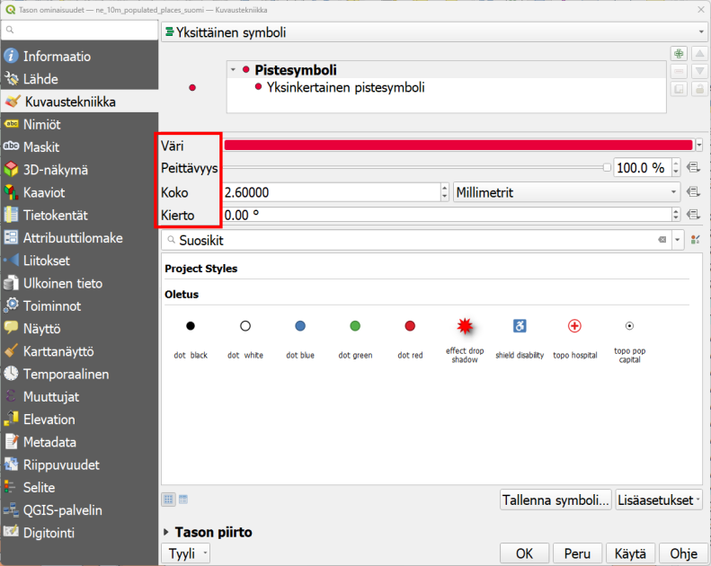
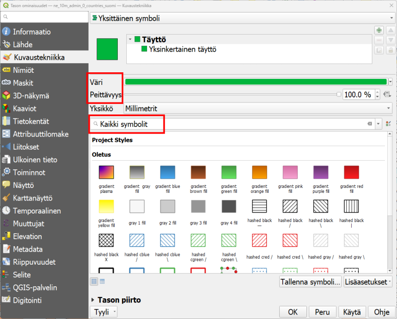
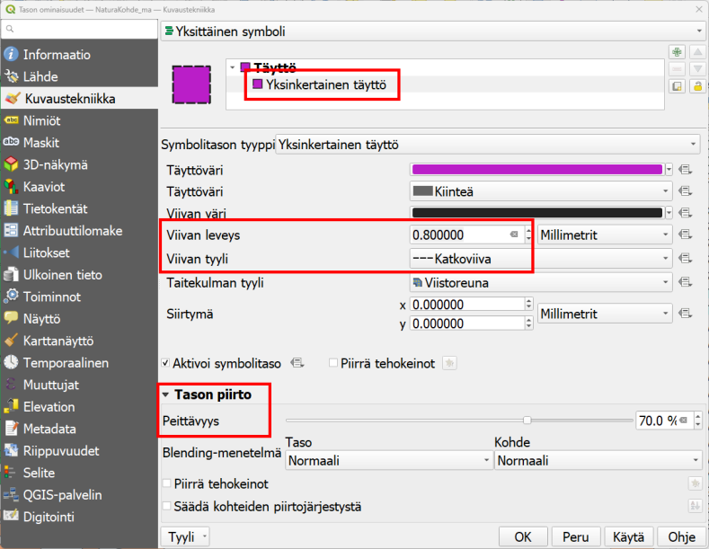
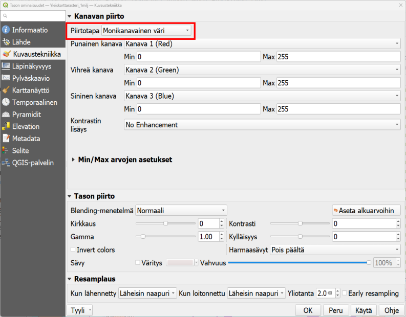

# Harjoitus 3: Paikkatietoaineiston visualisointi

## Harjoituksen sisältö

Harjoituksessa tehdään visualisoinnit sekä vektori- että rasteriaineistosta.

## Harjoituksen tavoite

Koulutettava oppii eri aineistotyyppien visualisointitapoja.

## Valmistautuminen

Käynnistä QGIS-ohjelmisto. Avaa uusi QGIS-projekti ja tallenna se nimellä (**Projekti → Tallenna nimellä…**) “**QGIS_harjoitus_3**”.

## Vektoriaineistojen visualisointi

Aloita tutkimalla edellisessä harjoituksessa avattua tiestötasoa. Jos teit uuden QGIS-projektitiedoston, lisää taso painamalla **Lisää vektoritaso -painiketta** ja selaamalla tiedostoon **.../kurssihakemisto/MML/YK_1M/TieViiva.shp**. 
Paina hiiren oikealla painikkeella tason nimeä (TieViiva) tasoluettelossa. Valitse valikosta **Ominaisuudet**:

**Tason ominaisuudet** -ikkuna aukeaa. Huomaa vasemmalla oleva sivupalkki, josta löytyy eri ominaisuudet jaoteltuna aihekohtaisesti. Samaisessa sivupalkissa on **Kuvaustekniikka-alamenu**, jonka valittuasi pääset muokkaamaan tason tyyliominaisuuksia:

{width:50%}

Vaihda **Väri- ja Leveys-arvot**, ja paina **Käytä**. Sillä tavalla saat näkyviin tekemäsi muutokset sulkematta **Tason ominaisuudet -ikkunaa**. Avaa vielä jokin **symbolikirjasto**, esimerkiksi **Suosikit**, ja muuta viivan tyyliksi jokin sinua miellyttävä tyyli. Paina sitten **OK**, ikkuna sulkeutuu ja tiestö-taso näkyy nyt määrittämäsi visualisointityylin tavalla.
Muut paikkatietoaineistojen visualisoinnin työkalut saa käyttöön samalla tavalla, avaamalla hiiren oikealla **Properties** ja sivupalkista **Kuvaustekniikka**. Eri vektoriaineistotyypeillä (piste, viiva, monikulmio) on erilaiset kuvaustekniikan työkalut, vaikkakin ne muistuttavat paljon toisiaan. Esimerkiksi pistetasolle ei voida tehdä samoja tyylittelyjä kuin viiva- tai monikulmiotasolle. Rasteriaineistojen työkalut taas eroavat melko paljon vektoriaineistojen työkaluista. Katsomme näitä myöhemmin tässä harjoituksessa.

Lisätään nyt toinen vektorimuotoinen aineisto QGIS-projektiimme. Käytä samaa työkalua kuin edellisessä harjoituksessa: avaa siis uusi taso painamalla **Lisää vektoritaso** -näppäintä. Etsi **.../kurssihakemisto/NaturalEarth/ne_10m_populated_places/** hakemistosta aineisto nimellä **ne_10m_populated_places_suomi.shp**. Tämä aineisto sisältää NaturalEarth-kaupunkiaineiston Suomesta.
Avaa pistetason kuvaustekniikkaikkuna samalla tavalla kuin äsken viivatason yhteydessä. Huomaa erot viiva- ja pistetason kuvaustekniikan määrittelyissä:

{width:50%}

Vaihda pisteen **Väri** ja **Koko** ja paina taas **Käytä**.** Pikanäppäimellä F7** saat avatuksi **Tason tyylit -ikkunan**, joka on jatkuvasti avoinna karttaikkunan oikeassa laidassa. Tällöin voit helposti vaihtaa kaikkien tasojen kuvaustekniikkaa ja näet heti, miltä uusi tyyli näyttää. Vaihda symbolia ja kokeile myös, miten **Kierto** vaikuttaa symbolin näkymiseen.

Toistetaan samat asiat vielä monikulmiotason kanssa. Avaa nyt toinen NaturalEarth-aineisto, jossa on Suomen alue erotettuna. Etsi **ne_10m_admin_0_countries**-hakemistosta **ne_10m_admin_0_countries_suomi.shp**

{width:50%}

ja lisää aineisto projektiin. Avaa sen kuvaustekniikkaikkuna ja huomaa erot verrattuna piste- ja viiva-aineistojen ominaisuuksiin.
Muokkaa tason väriä **Väri-kohdasta** ja valitse tasolle jokin symboli haluamastasi kirjastosta. Voit myös kokeilla eri **Peittävyys-arvoja**. Paina Käytä ja kun olet testannut tarpeeksi, paina **OK**.

Saattaa olla, että aineistotasot peittävät toisensa vaikka siten, että monikulmio aineisto peittää muut sen alle jäävät aineistot. Kokeile muuttaa tasojen keskinäistä järjestystä ja siten tasojen näkymistä raahaamalla/vetämällä tasot uuteen järjestykseen **Tasoluettelossa**. Useimmiten monikulmiotasot on hyvä jättää alimmiksi tasoiksi. Jos kartalla halutaan visualisoida jotakin rasterikuvaa, kannattaa se/ne yleensä pitää myös alimpina tasoina. Uudelleen järjestettynä karttasi näyttää tältä: 

Voit myös piilottaa tai näyttää tasoja painamalla tason nimen vasemmalla puolella olevaa ruutua.

## Monikulmioaineiston edistynyt visualisointi

Lisää QGIS-projektiin uusi paikkatietoaineisto: käytämme tässä harjoituksessa Suomen ympäristökeskuksen Natura2000-aluetietoaineistoa. Lisää kurssihakemistosta vektoriaineisto: **.../kurssihakemisto/SYKE/Natura2000/NaturaKohde_ma.shp-tiedosto** QGIS-projektiin.

Ensimmäiseksi muutamme vektoriaineiston väriä. Avaa tason **Properties → Kuvaustekniikka** ja klikkaa **Väri-kohdassa** olevaa väripalkkia. Valitse haluamasi väri vektoriaineistolle. Huomaa, että voit määritellä värit arvo **HSV-** (Hue, Saturation, Value) tai **RGB-arvoilla** (Red, Green, Blue). **Peittävyys-arvolla** säädät värin läpinäkyvyyttä. Kokeile myös **Värikarttaa**, **Väripyörää** ja **Liukuväri** (välilehdet).
Valittuasi sopivan värin, paina **OK**.
Paina sen jälkeen **Properties-ikkunasta Käytä**. Näin **Properties-ikkuna** pysyy auki ja voit katsoa tyylien muutoksia karttanäkymässä.
Kun olet valinnut haluamasi värin, paina **OK**.

{width:70%}

Avaa uudelleen tason **Properties-ikkuna**. **Kuvaustekniikka-asetuksista**, valitse ensin **Simple fill** oheisen kuvan mukaisesti:

{width:70%}

Sen jälkeen valitse reunaviiva katkoviivaksi kohdasta **Piirron tyyli**. Viivan paksuudeksi voit määritellä 0,8 millimetriä.
Lopuksi voit vielä määritellä **Tason renderöinti -kohdasta** (valikko aukeaa pientä nuolta klikkaamalla) **Peittävyys-kohtaan** arvoksi 70%.

## Rasteriaineistojen visualisointi

Tutustutaan nyt rasteriaineistoihin. Avaa uusi, tyhjä QGIS-projekti ja lisää uusi aineisto napauttamalla **Lisää** rasteritaso –pikakuvaketta vasemmasta sivupaneelista: 

Etsi datahakemistosta **Yleiskarttarasteri_1milj.png**, joka on **…/kurssihakemisto/MML/**-kansiossa. QGIS ilmoittaa, että aineiston koordinaattijärjestelmä on tuntematon, ja olettaa koordinaattijärjestelmäksi WGS84. Aseta rasteriaineiston koordinaattijärjestelmäksi **ETRS89- / ETRS-TM35FIN**. Klikkaa tason nimeä hiiren oikealla napilla, valitse **Properties** ja **Lähde-välilehti**. Etsi tasokoordinaattijärjestelmä (projisoidut koordinaattijärjestelmät) **EPSG:3067 - ETRS89- / ETRS-TM35FIN** ja paina **OK**:

{width:70%}

Tämä rasteriaineisto on MML:n tuottama taustakartta, johon on sisällytetty Suomen tiet, kaupungit ja muita yleiskartan tarkoitusta ajavia aineistoja. Käytetty visualisointi on tuttu paperikartoilta.
Avaa nyt rasteritason **Kuvaustekniikka-ikkuna** samalla tavalla kuin vektoriaineistojen kanssa. Huomaa erot työkaluissa ja ominaisuuksissa rasteri- ja vektoriaineistojen välillä.

Kokeile vaihtaa rasterin kuvaustekniikan asetuksia. **Renderöintitapa** sisältää erilaisia rasteriaineistojen visualisointikeinoja, esimerkiksi **Multiband color -visualisointitavassa** käytetään kolmea eri näkyvän valon kanavaa (R=red, G=green, B=Blue eli RGB) rasterikuvan visualisoimiseen. Väriarvoja muokkaamalla voidaan muokata tapaa, jolla rasterikuvan pikselit näkyvät kartalla. Lisäämänne rasteriaineiston (yleiskarttarasteri) visualisointi on asetettu siten, että se näyttää parhaimmalta, jos kanavat asetetaan seuraavalla tavalla: punainen kanava on kanava 1, vihreä kanava on kanava 2 ja sininen kanava on kanava 3.
On tärkeä hahmottaa tapa ja logiikka, jolla rasteriaineistoja visualisoidaan. Kokeile nyt vaihtaa kanavien järjestystä. Muista, että painamalla **Käytä** voit kurkistaa muutoksiin. Voit sillä tavalla kokeilla eri asetuksia sulkematta **Tason ominaisuudet → Kuvaustekniikka-ikkunaa**. 

Eri kanavien kuvaustekniikoiden muuttamisella on merkitystä esimerkiksi orto- ja satelliittikuvia tarkasteltaessa. Visualisoimalla näkyvän valon kanavat eri tavoin voidaan havaita ilmakuvista jotain, joka muuten jäisi huomaamatta. Lisäksi satelliittikuva-aineistot saattavat sisältää muitakin kuin näkyvän valon aallonpituuksia, esimerkiksi lähi-infrapunakanavan, joka täytyy visualisoida jollain näkyvällä värillä ennen kuin sitä voidaan tarkastella.

:::{.hint-box}
**Psst! Muista tallentaa QGIS-projekti harjoituksen lopuksi.** 
:::

