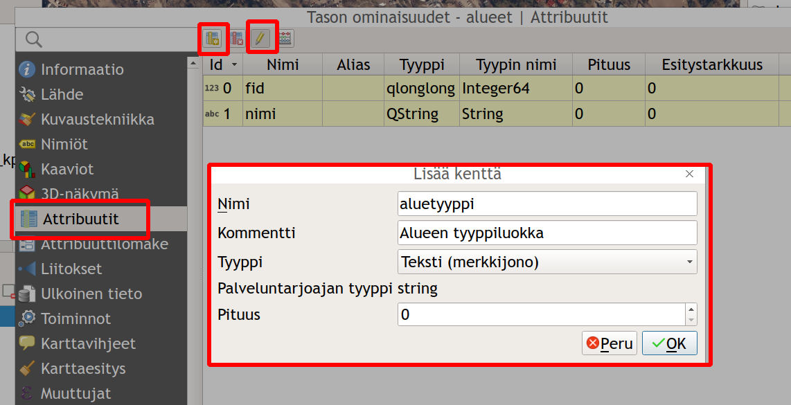
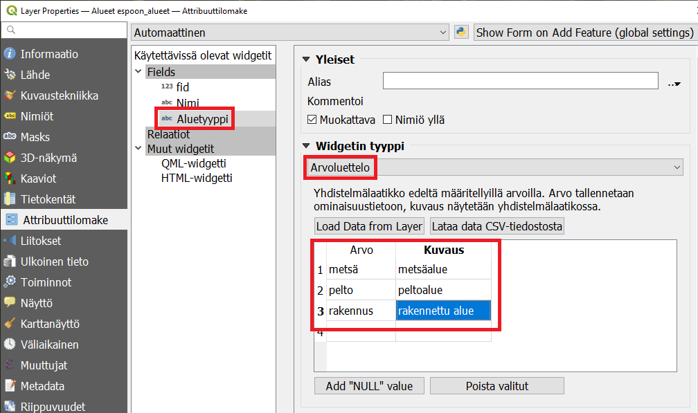
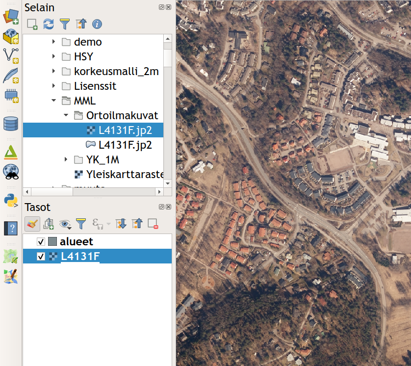
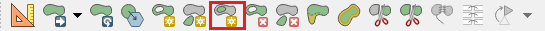
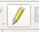

# Harjoitus 6: Paikkatietoaineiston editointi

#### Harjoituksen sisältö
Harjoituksessa digitoidaan uusi vektorimuotoinen paikkatietoaineisto.

#### Harjoituksen tavoite
Opiskelija oppii kuinka paikkatietoaineistoja tuotetaan ja editoidaan.

### Valmistautuminen
Luo uusi QGIS-projekti ja tallenna se nimellä (**Projekti → Tallenna nimellä…**) “**QGIS_harjoitus_6**”.

### Vektoriaineiston (GeoPackage) luominen
Luodaan uusi GeoPackage-aineisto valitsemalla työkalupalkista Uusi **GeoPackage-taso…**

Tee alla näkyvät valinnat **GeoPackage-ikkunaan**. Muista nimetä aineisto sopivalla tavalla (tässä esim. alueet), valitse **Geometriatyyppi-kohtaan MultiPolygoni**, valitse koordinaattijärjestelmäksi ETRS89 / TM35FIN(E,N) EPSG:3067 (harjoittelemme digitointia Espoossa käytössämme Suomen valtakunnallinen tasokoordinaattijärjestelmä TM35FIN). Muista vielä lopuksi lisätä **Nimi-attribuutti Lisää ominaisuustietolistaan -toiminnolla**.

Avaa juuri luomasi tason attribuuttitaulukko ja tarkista, että se on tyhjä. Tarkista myös, että määrittelemäsi kentät näkyvät sarakkeina.

**Fid-kenttä** muodostuu automaattisesti ja **Nimi-kentän** loimme itse äskeisessä määrittelyikkunassa.
Tarkastellaan nyt attribuutteja lähemmin **Tason ominaisuudet -ikkunassa**. Avaa juuri luomasi Alueet-tason Tason ominaisuudet -ikkuna ja valitse vasemmalta **Attribuutit (aikaisemmin Fields)**. Attribuutit-välilehdessä pystytään muokkaamaan attribuuttitaulun tietorakennetta. Aseta muokkaus päälle klikkaamalla kynäikonia. Uuden kentän pystyt lisäämään **Uusi kenttä -painikkeesta**, joka on varustettu keltaisella tähti-ikonilla. 
Anna uudelle kentälle nimi “**aluetyyppi**” ja aseta tyypiksi “**Teksti**” ylläolevan kuvan mukaisesti. Klikkaa **OK** lisätäksesi uuden kentän listaan. Klikkaa tämän jälkeen uudestaan kynäikonia lopettaaksesi muokkauksen ja tallenna muutokset.

### Digitoitavan tason tietorakenne
Jatketaan edelleen **Tason ominaisuudet -ikkunassa**. Valitse nyt vasemmalta **Attribuuttilomake-välilehti**. Tässä välilehdessä voit määrittää sääntöjä ja rajoituksia laatimillesi tietokentille (ts. taulun sarakkeille). Kyseiset määritykset auttavat säilyttämään tietorakenteen sekä itse tiedon laadun ja helpottavat myös digitointia.
Valitse **Käytettävissä olevista käyttöliittymäelementit -kohdasta** aluetyyppi-kenttä ja valitse **Muokkauksen tyyppi -kohdasta Arvoluettelo** alla olevan kuvan tapaan. Mikäli et näe nyt aluetyyppi-saraketta, sulje vielä **Tason ominaisuudet -ikkuna** ja avaa se uudelleen.

Arvoluettelon avulla käyttäjän on mahdollista määrittää arvoja vetovalikosta editointia tehdessään. Muokkaa soluja tuplaklikkaamalla. Määritä arvot kuvassa näkyvän luettelon mukaisesti. Kirjaa myös aluetyypeille kuvaukset halutessasi. Kuvauksista on hyötyä yleisesti tietorakenteiden eheyden ylläpitämiseksi. Kun olet valmis, klikkaa **OK** palataksesi karttanäkymään. 

### Pohjakartan lisääminen
Voit käyttää digitoinnin pohjana Maanmittauslaitoksen ilmakuvia. Lisää nyt ortoilmakuva **L4131F.jp2-rasteritiedosto** kansiosta **.../kurssihakemisto/MML/Ortoilmakuvat/** QGISiin. Muista, että myös rasteriaineistot saat käyttöösi helposti raahaamalla tiedoston karttaikkunaan tai **Tasot-paneeliin**. 

### Digitoinnin aloittaminen
Valitse kartalta mieleisesi alue, jota lähdet digitoimaan. Zoomaa tarpeeksi lähelle, jotta erotat digitoitavat alueet hyvin (esim. rakennukset).

**Tarttumisen työkalut** - työkalupalkin saa kiinnitettyä käyttöliittymään (ellei se jo siinä ole) joko… 
1 … painamalla QGISin käyttöliittymän reunoilla hiiren oikealla ja rastittamalla Työkalut-kohdan alta Tarttumisen työkalut tai sitten
2 … avaamalla erillisen ikkunan tarttumisen asetuksille ylämenusta Työkalut → Tarttumisen työkalut.
Aktivoi itse työkalu käyttöösi työkalupakistasi löytyvästä punaisesta **magneetti-ikonista** ja aseta sen asetukset seuraavasti.

Asetuksissa määritetään tarttumiseen käytettävä yksikkö (metri) ja etäisyys (5 metriä). Lisäksi asetetaan tarttumisen kohdistuvan aktiiviseen tasoon, sen taitepisteisiin ja/tai segmentteihin sekä myös **Topologinen muokkaus** ja **Tarttuminen risteyksessä** (Snapping on intersection).

Klikkaa seuraavaksi **Lisää monikulmiokohde -työkalua**  ja aloita digitointi. 

Muista, että voit muokata **Tarttumisen asetuksia** palaamalla yllä kuvattuun ikkunaan ja jättämällä se ikkunan sivuun muokataksesi asetuksia nopeasti. Digitoi nyt 5-8 polygonia. Kun olet valmis, klikkaa jälleen kynä-ikonia lopettaaksesi ja tallentaaksesi editoinnin. 

Päällekkäisten kohteiden syntymisen voi myös välttää alla olevan animaation tavalla.

Tämän saavuttaaksesi voit aktivoida **Vältä leikkauksia -valinnan** päälle **Avaa tarttumisen asetukset... -valikosta**. Avaa ensin **Tarttumisen työkalut -paneelista Avaa tarttumisen asetukset**.

Näin sinulle aukeaa alla olevan mukainen tarttumisen asetukset määrittelyikkuna, jossa voit tehdä määrityksiä muun muassa leikkausten suhteen. Leikkauksilla viitataan tässä kohteiden niin sanottuihin intersektioihin.

> Psst! Muista tallentaa QGIS-projekti harjoituksen lopuksi.

### Lisätehtävä: CAD-digitointi
Voit kokeilla myös CAD-pohjaista digitointia, joka on kehittynyt verrattain paljon QGISin uudessa versiossa. Työkalut saat esiin lisäämällä **Digitoinnin lisätyökalut** -ylämenusta **Näytä → Työkalut → Digitoinnin lisätyökalut**. 
Kokeile erilaisia työkaluja, esimerkiksi Täytä piiri -työkalua. Tätä voit hyödyntää esimerkkitapauksena peltoja digitoidessa. Kuvitellaan, että peltojen sisään jää aina välillä pieniä metsäsaarekkeita, jotka olisi digitoitava 

metsä-kohteiksi. **Täytä piiri -työkalulla** pystyt irrottamaan alueen omaksi objektiksi (ks. kuva alla).

### Lisätehtävä: ominaisuustietojen lisääminen
Seuraavaksi laskemme pinta-alan ominaisuustietoja edellä muodostettuun paikkatietoaineistoon. Avaa Alueet-tason ominaisuustietotaulu (attribuuttitaulu).

Laita muokkaustila taas päälle kynäikonista  ja muokkaa muutamaa Nimi-kentän alueen nimeä samalla tavalla kun tekisit laskentataulussa (tuplaklikkaamalla). Huomaa, että muokkaaminen on mahdollista vain jos muokkaustila on päällä.
Avaa nyt **Kentän arvojen laskin -työkalu** seuraavan pikakuvakkeen avulla: 

Tällä toiminnolla voimme luoda uusia tai päivittää jo olemassa olevia ominaisuustietotaulun kenttiä.  Pinta-alan laskentaa varten muunnetaan neliömetrit neliökilmetreiksi jakamalla pinta-ala 1 000 000:lla. Kirjoitetaan **Lauseke-kenttään** kaava **$area / 1000000**.

Painamalla **OK** saat laskettua kunkin alueen pinta-alan omaan kenttäänsä:

