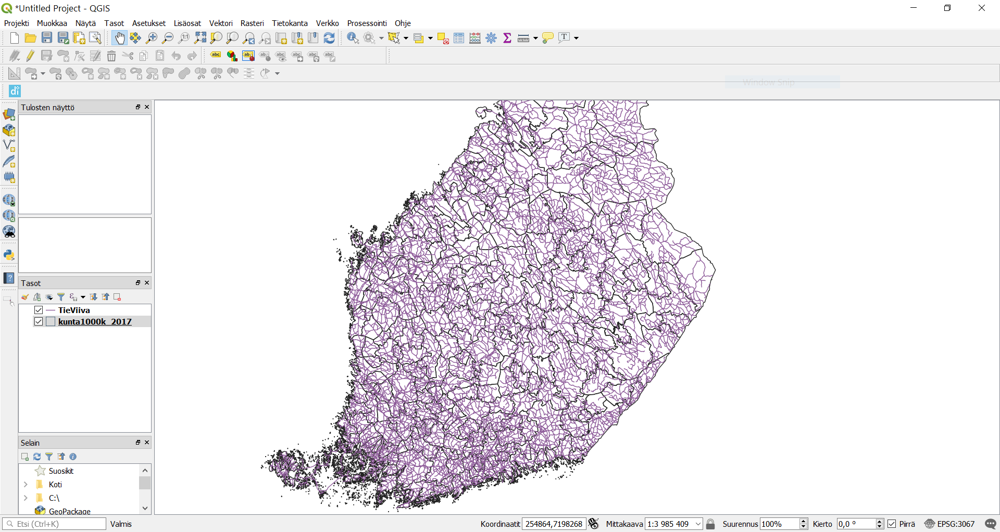
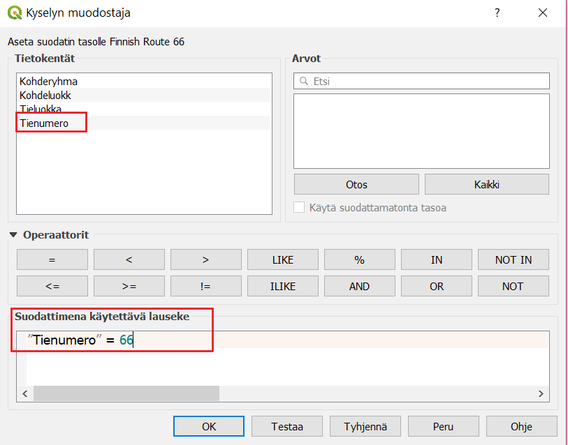
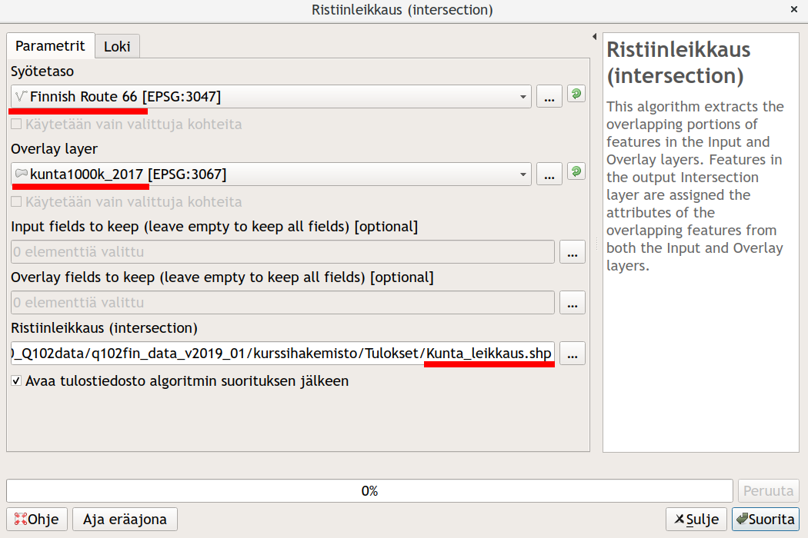
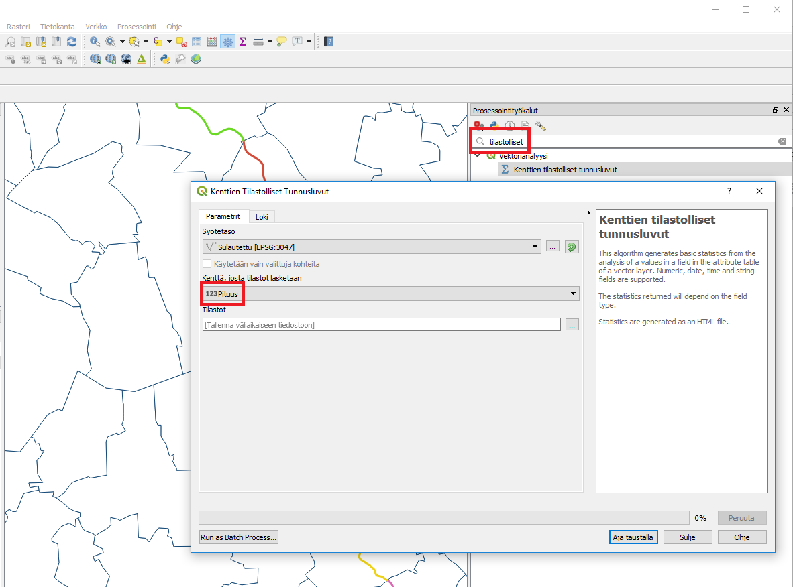

#Harjoitus 7: Paikkatietoanalyysit

####Harjoituksen sisältö

Harjoituksessa tutustutaan QGISin erilaisiin paikkatietoanalyyseihin.

####Harjoituksen tavoite

Koulutettava oppii käyttämään eri aineistoille tarkoitettuja paikkatietoanalyysejä tarkoituksenmukaisesti.

###Valmistautuminen

Luo uusi QGIS-projekti ja tallenna se nimellä (**Projekti → Tallenna nimellä…) “QGIS_harjoitus_7”**. 
Lisää projektiin **kunta1000k_2017.gpkg**-tiedosto (**.../kurssihakemisto/Tilastokeskus/kunnat2017/**), jossa on Suomen kuntarajat. 
Lisää karttaprojektiin vielä Maanmittauslaitoksen 1:1M yleiskartan **TieViiva-aineisto** (kansiosta **.../kurssihakemisto/MML/YK_1M/**).
Voit asettaa kunnat-monikulmion täytevärin pois ja saada siten tieviiva-aineiston paremmin näkyviin:

Karttanäkymä näyttää nyt kunkin väriasetuksia lukuunottamatta tältä:

Voit tarkistaa/muokata projektisi koordinaattijärjestelmän asetuksia **Projekti → Properties → Koordinaattijärjestelmä** -välilehdessä tai klikkaamalla oikeasta alareunasta:

Kummatkin tavat avaavat projektin koordinaattijärjestelmän määrityslomakkeen. Tarkista, että järjestelmä on ETRS89 / ETRS-TM35FIN.
Muista, että voit lisätä ongelmitta projektiisi aineistoja eri karttaprojektioissa. Monet analyysityökalut eivät kuitenkaan toimi, jos analyysin lähtöaineistot eivät ole samassa koordinaattijärjestelmässä.

Huomautus GK-koordinaatiston EPSG-koodeista!
Suomalaiset koordinaattijärjestelmät (vanhat ja uudet) ovat pääosin hyvin tuettuina QGIS-ohjelmistossa. On kuitenkin huomautettava, että EPSG-määrittelyissä on lievää epäjohdonmukaisuutta. Esimerkiksi tarkemmat GK-koordinaattijärjestelmän koodit löytyvät EPSG:n luettelosta kahteen kertaan: EPSG:3126 – EPSG:3138 koodeilla löytyvät koordinaattijärjestelmät ETRS-GK19FIN - ETRS-GK31FIN. Nämä ovat kuitenkin ”virheellisiä”, keskimeridiaanin koordinaatti on aina 500 000.

OIKEAT EPSG-koodit: EPSG:3873 - EPSG:3885

VIRHEELLISET EPSG-koodit: EPSG:3126 -  EPSG:3138

###Vektorianalyysit

Tässä harjoituksessa on tarkoitus etsiä ne kunnat, joiden alueella kulkee suomalainen versio kuuluisasta Route 66 -tiestä. Lyhyesti harjoituksen kulku on seuraava:
- Valitaan tieaineistosta ne tieviivat, joiden numero on 66
- Tehdään spatiaalinen analyysi kunta- ja tieviiva-aineiston kanssa, jonka myötä viiva-aineisto saa kunta-aineiston sisältämät tiedot
- Yhdistetään tieviivat kunnan nimen avulla

Monista **TieViiva taso** hiiren oikealla näppäimellä aukeavasta valikosta **Monista taso** vaihda uuden tason nimeksi *Finnish Route 66*:ksi samasta valikosta **Nimeä taso**.
Samasta valikosta löytyy myös **Suodata** -toiminto, joka määrittelee, mitä aineiston kohteita tämä taso käyttää. 

Kirjoita **Suodattimena käytettävä lauseke** -kenttään ”Tienumero” = 66. Saat kentän nimen suoraan lausekkeeseen **Tietokentät**-kohdasta tuplaklikkaamalla ja **Operaattorit**-kuvakkeita klikkaamalla. Kun painat OK, karttanäkymässä näkyy enää suodattimen läpäisevät kohteet.

Seuraavaksi lähdemme käsittelemään aineistoja **Vektori**-ylämenusta, josta löytyvät ensisijaiset  työkalut vektorianalyysien toteuttamiseen:

Käynnistä **Ristiinleikkaus(intersection...)**-työkalu **Geoprosessointi**-valikosta. Määrittele leikattavaksi tasoksi tiestöaineisto ja leikkaavaksi tasoksi kuntaraja-aineisto:

Suorita analyysi painamalla Suorita ja paina sen jälkeen **Sulje**. Analyysi luo uuden väliaikaisen tulostason nimeltä **Ristiinleikkaus (intersection)**.
Karttaikkunassa aineisto näyttää samalta kuin alkuperäinen aineisto. Vertaile tasojen (**Finnish Route 66** ja **Ristiinleikkaus (intersection)**) ominaisuustietoja. Mitä huomaat? 
Seuraavaksi voit visualisoida syntyneen tulostason tieviivat kunkin kunnan osalta eri välillä: määrittele kuvaustekniikka luokittelemalla tiestö kunnan nimen perusteella käyttäen kenttää Nimi. 
Aktivoi **Näytä kohteiden lukumäärä** -toiminto (paina hiiren oikealla näppäimellä tason nimen päällä Tasoluettelossa).

Tasoluettelossa luokittelun pitäisi näyttää suunnilleen seuraavalta (värit ja viivojen paksuus on sen mukainen kuin olet määritellyt):

Seuraavaksi voimme yhdistää erilliset tieviivat **Sulauta**-työkalun (Dissolve) avulla. Valitse työkalu **Vektori-Geoprosessointi → Sulauta**. Sulauta tieviivat kunnan nimen (tai numeron) perusteella ja tallenna lopputulos kurssihakemistoon haluamallasi nimellä (esimerkiksi kunta_sulautettu.shp). Täytä asetukset Sulauta-ikkunassa kuvan mukaisesti:

Paina **Suorita** ja sitten **Sulje**.
Voit kopioida aiemmin luodun tason tyylin helposti uudelle aineistoille. Valitse hiiren oikealla näppäimellä avautuvasta valikosta **Tyyli → Kopioi tyyli**. Valitse äsken luotu taso ja **Tyyli → Liitä tyyli**. Kun laitat vielä kohteiden lukumäärän näkyviin, niin lopputuloksen pitäisi tasoluettelossa olla seuraava:

Lopuksi voimme laskea, kuinka pitkä pätkä tietä nro. 66 osuu kunkin kunnan alueelle.  Avaa ominaisuustietotaulukko ja käytä **Kentän arvojen laskin**-työkalua. Luo uusi kenttä, jossa on kunkin tieviivan pituus hyödyntämällä **Geometria**-ryhmästä **$length**-funktiota.

Psst! Muista tallentaa QGIS-projekti harjoituksen lopuksi.

##Lisätehtävä: ominaisuustietojen lisääminen ja tarkastelu

Lopuksi voimme laskea, kuinka suuri osa suhteellisesti (osuus koko pituudesta) tietä nro. 66 osuu kunkin kunnan alueelle. Prosenttilaskun toimittamiseksi tarvitset tiedon tiesegmenttien yhteenlasketusta kokonaispituudesta eli summasta, jonka saat käyttöösi Kenttien tilastolliset tunnusluvut -työkalun avulla: avaa yläpalkista **Prosessointi → Työkalut** ja kirjoita etsi hakukentän avulla työkalu **Kenttien tilastolliset tunnusluvut**. 

Anna avautuvassa ikkunassa kentäksi, josta tilastot lasketaan, edellisessä tehtävässä laskemasi pituus-kenttä:
Prosenttilasku tehdään samalla tavalla kuin pituuden tai pinta-alan laskenta eli tehdään uusi sarake, jonka kohteille lasketaan arvot seuraavan funktion avulla (heittomerkkien sisään jäävä sana/merkkijono viittaa sarakkeen nimeen ja ‘summa’ laskemaasi arvoon):

("Pituus" / summa)`*100`

Lopuksi voit visualisoida kartalle kunkin kunnan osuuden haluamallasi tavalla.

